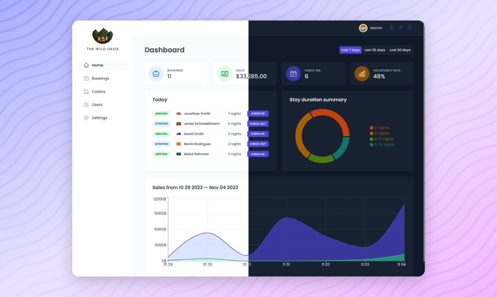

<div align="center">
  <h1>The Wild Oasis </h1>

  <h3>
    <a href="https://the-wild-oasis-jade-three.vercel.app/">
      <strong>Live Site</strong>
    </a>
  </h3>

</div>

<!-- Brief -->
<p align="center">
Welcome to <b>The Wild Oasis</b>! This is a hotel management admin web app where employees can manage cabins, bookings, and guests.  
It is built with <b>Angular 20</b> using <b>SSR</b>, <b>zoneless rendering</b>, and <b>PrimeNG</b> for UI, with <b>Firebase</b> as backend for authentication and real-time data.
</p>

<!-- Screenshot -->
<a align="center" href="https://the-wild-oasis-jade-three.vercel.app/">



</a>
---

## ✨ Key Features

- User authentication via Firebase  
- Dashboard with stats on bookings, check-ins, and revenue  
- Manage cabins (create, update, delete)  
- Manage guests and bookings (check-in, check-out, update status)  
- Real-time data synchronization using Firebase  
- Responsive UI built with PrimeNG  
- Dark mode support  
- Optimized performance with Angular SSR and Zoneless rendering  

---

## 🛠️ Technologies Used

- **Angular 20** with **Server-Side Rendering (SSR)**  
- **PrimeNG** for modern, responsive UI components  
- **Zoneless Angular** (using Signals for reactivity)  
- **Firebase** (Authentication, Firestore, Real-time Database)  
- **TypeScript**  
- **SCSS**  

---

## 📚 What I Learned

This project helped me deepen my skills in:  
- **SSR in Angular** for performance & SEO  
- **Zoneless Angular** with Signals for fine-grained reactivity  
- **PrimeNG** to build production-ready UIs quickly  
- **Real-time applications** using Firebase  
- **Scalable architecture** for admin dashboards  

---

## ⚡ Setup Instructions

To run this project locally:

1. Clone the repo:
   ```bash
   git clone https://github.com/basmasalim/The-Wild-Oasis.git
   cd The-Wild-Oasis

2. Install dependencies:

   ```bash
   npm install
   ```
3. Setup environment variables:

   * Add Firebase keys in `src/environments/environment.ts`
4. Run the development server:

   ```bash
   ng serve
   ```
5. Open `http://localhost:4200` in your browser.

## 🙏 Acknowledgments

Special thanks to the Angular and Firebase communities for their amazing documentation and tools.
